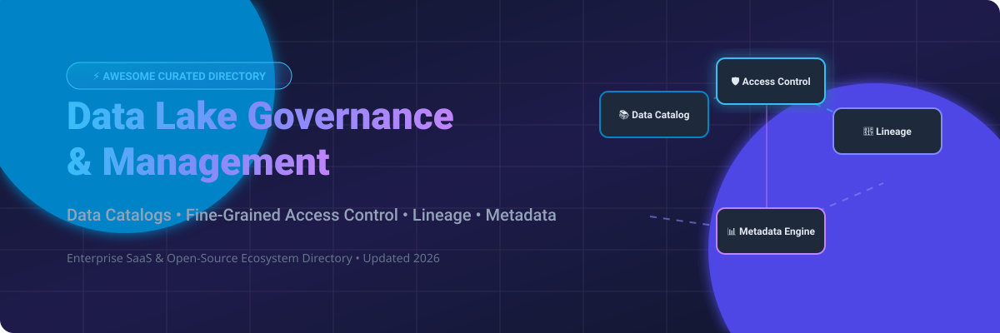

# Awesome Data Lake Governance & Management 🏞️ 🛡️

  

  
  
  
  
  
  

---

## 🌟 Top Data Lake Governance & Management Ecosystem 🌐

**Curated List of Commercial Data Governance Platforms & Open-Source Data Catalog Tools**  
*Focused on Data Catalogs, Fine-Grained Access Control, Column/Row-Level Security, Data Lineage, Metadata Management & Self-Hosted Governance Engines.* 🛡️

**Last updated: October 2026** 📅

---

### 📌 Overview & SEO Summary 🔍

Welcome to the definitive curated directory of **data lake governance platforms**, **open-source data catalog tools**, **fine-grained access control (FGAC)** software, and **metadata management frameworks**. Whether you are evaluating hyperscaler-native governance suites (*AWS Lake Formation*, *Microsoft Purview*), lakehouse-integrated catalogs (*Databricks Unity Catalog*), enterprise metadata intelligence solutions (*Collibra*, *Alation*, *Atlan*), or self-hosted open-source alternatives (*LinkedIn DataHub*, *OpenMetadata*, *Apache Atlas*, *Apache Ranger*, *OpenLineage*, *Amundsen*), this ecosystem guide provides actionable metrics, star counts, exact pricing tiers, and market intelligence.

**Key Market Context:**
- **DataHub (LinkedIn)** is the **most comprehensive open-source data catalog**, boasting **10.2K+ GitHub stars**, **50+ ingestion connectors**, real-time Kafka metadata streaming, and automated column lineage. 🚀
- **CKAN** leads the **open data marketplace sector** with **4.1K+ GitHub stars**, powering public data portals for governments worldwide (data.gov, data.gov.uk). 🌍
- **OpenMetadata** provides a **unified metadata architecture** with **5.2K+ GitHub stars**, offering column lineage, data quality profiling, and policy enforcement in one framework. 📋
- **Apache Ranger** remains the **de facto standard for Hadoop & big data access control**, with **1.8K+ stars** providing attribute-based access control (ABAC) and centralized audit logs. 🛡️

---

## 📑 Table of Contents 📜

- [🏢 SaaS & Commercial Platforms](#-saas--commercial-platforms)
- [🔓 Open-Source GitHub Projects](#-open-source-github-projects)
- [🛠️ How to Contribute](#%EF%B8%8F-how-to-contribute)
- [📊 Star History](#-star-history)
- [🤝 Support & Sponsorship](#-support--sponsorship)
- [⚠️ Disclaimer](#%EF%B8%8F-disclaimer)

---

## 🏢 SaaS / Commercial Platforms 📈

> [!NOTE]
> **Market Size & Structure:** The global Data Governance & Metadata Management market is estimated at **~$6.5 Billion in 2026** and projected to reach **~$14.8 Billion by 2030** (CAGR ~22.8%). The sector is **moderately fragmented**: cloud hyperscalers (AWS, Microsoft) and data platform leaders (Databricks) dominate infrastructure-native governance, while specialized independent vendors (Collibra, Alation, Atlan, Immuta) capture enterprise business glossaries and multi-cloud security control planes without a single "winner-take-all" outcome. 💡

| SaaS / Commercial Platform | Company / Owner | Company Size (Valuation / Revenue) | Standard Edition Starting Price | Free Tier / Free Trial Limits | Description |
| :--- | :--- | :--- | :--- | :--- | :--- |
| **[Microsoft Purview](https://www.microsoft.com/en-us/security/business/microsoft-purview)** 🔷 | Microsoft | **$3.90 Trillion** (Market Cap) | **$0.50/catalog hour** (~$365/mo) + **$5/user/month** (Info Protection) | **90-day free trial** for Purview Suite; free version limited to **1,000 annotated assets** | **Microsoft-native data governance** — **Data catalog, lineage, and classification** . **Integrates with Azure, Microsoft 365, and Dynamics 365** . **Data Loss Prevention (DLP)** and **Insider Risk Management** . |
| **[AWS Lake Formation](https://aws.amazon.com/lake-formation/)** ☁️ | Amazon | **$2.0 Trillion** (Market Cap) | **Free service** (pay only for underlying AWS S3/Glue/Athena usage; storage API at $2.25/TB scanned) | **Always free** core governance; 1M Glue catalog requests/mo free for 12 months | **AWS-native data lake governance** — **Fine-grained access control** at table, column, and row level . **Centralized permissions management** across S3, Glue, Athena, and Redshift . **Tag-based access control (LF-TBAC)** for scalable governance . **Cross-account data sharing** with governed tables . |
| **[Databricks Unity Catalog](https://www.databricks.com/product/unity-catalog)** 🧱 | Databricks | **$190 Billion** (Valuation) / **$7B ARR** | **Included in Premium Workspace tier** (DBU pricing starting at **$0.07–$0.40 per DBU-hour**) | **14-day free trial** with **$400 in usage credits**; limited free edition for non-commercial learning | **Unified governance for data and AI** — **Fine-grained access control** for tables, views, volumes, and models . **Automated data lineage** across notebooks, jobs, and dashboards . **Attribute-based access control (ABAC)** with Unity Catalog . **Cross-workspace and cross-cloud governance** . |
| **[Collibra](https://www.collibra.com/)** 🏢 | Collibra | **$5.25 Billion** (Valuation) / **~$300M ARR** | **$150,000/year** (Enterprise base contract) | **No public free trial or free tier**; interactive self-guided product tours & custom demo available | **Enterprise data intelligence platform** — **Data catalog, governance, and lineage** . **Business glossary and data stewardship** . **The most comprehensive enterprise data governance platform** . |
| **[Alation](https://www.alation.com/)** 🔵 | Alation | **$1.7 Billion** (Valuation) / **~$109M ARR** | **$60,000/year** (Base enterprise deployment) | **No public free trial or free tier**; guided POC environment available upon request | **Data intelligence platform** — **Data catalog with behavioral analysis** . **Collaborative data curation and governance** . **The most user-friendly enterprise data catalog** . |
| **[Immuta](https://www.immuta.com/)** 🛡️ | Immuta | **$1.0 Billion** (Valuation) / **~$100M ARR** | **Custom enterprise pricing** (~$50,000/year minimum entry point) | **Custom sales-managed free trial** (typically 14 to 30 days upon request); no permanent free tier | **Data security platform** — **Dynamic data access control** and **policy enforcement** . **Attribute-based access control (ABAC)** . **Sensitive data discovery and masking** . |
| **[Atlan](https://atlan.com/)** 🟣 | Atlan | **$750 Million** (Valuation) / **~$75M ARR** | **$100,000/year** (Enterprise mid-market entry point) | **14-day to 30-day guided free trial** upon enterprise request; no self-serve free tier | **Modern data catalog** — **Data discovery, lineage, and governance** . **Collaborative workspace for data teams** . **The most modern data catalog platform** . |
| **[Privacera](https://privacera.com/)** 🔒 | Privacera | **~$200 Million** (Est. Valuation) / **~$40M ARR** | **Custom enterprise pricing** (Quote-based via AWS Marketplace / Sales) | **30-day free trial** for PrivaceraCloud SaaS; no permanent free tier | **Data security and governance platform** — **Unified access control across multi-cloud** . **Built on Apache Ranger** . **Data discovery, classification, and masking** . |
| **[Okera](https://www.okera.com/)** 🎯 | Okera (Databricks) | **Acquired** (by Databricks) | **Discontinued as standalone** (Integrated into Unity Catalog) | **Service discontinued** | **Data access platform (acquired)** — **Acquired by Databricks** in 2023. **Technology integrated into Unity Catalog** . |

---

## 🔓 Open-Source GitHub Projects 💻

*Sorted by GitHub Stars Count (Descending)* 🌟

- **[DataHub (LinkedIn)](https://github.com/datahub-project/datahub)**   
  **Open-source metadata platform for data discovery**, Apache-2.0 licensed. **10.2K+ GitHub stars** — **the most comprehensive open-source data catalog** . **Metadata ingestion from 50+ sources** — Snowflake, BigQuery, PostgreSQL, Kafka, dbt, Looker, and more . **Data lineage, governance, and discovery** . **Real-time metadata streaming** with Kafka . **The enterprise-grade open-source data marketplace foundation** . 🏢

- **[OpenMetadata](https://github.com/open-metadata/OpenMetadata)**   
  **Unified metadata platform for data discovery and governance**, Apache-2.0 licensed. **5.2K+ GitHub stars** — **100+ connectors** for databases, dashboards, pipelines, and messaging . **Data lineage, quality, and governance** in one platform . **Column-level lineage** and **data profiling** . **The most modern open-source data catalog** . 📋

- **[Apache Atlas](https://github.com/apache/atlas)**   
  **Metadata and governance framework for Hadoop**, Apache-2.0 licensed. **4.8K+ GitHub stars** — **the most widely deployed open-source governance platform** in Hadoop ecosystems . **Native Apache Ranger integration** for **fine-grained access control** . **Data classification, lineage, and search** . **The foundation for enterprise Hadoop governance** . 🏛️

- **[Amundsen (Lyft)](https://github.com/amundsen-io/amundsen)**   
  **Data discovery and metadata engine**, Apache-2.0 licensed. **4.2K+ GitHub stars** — **data catalog with search and lineage** . **Neo4j / JanusGraph graph for relationship mapping** . **Used by Lyft, ING, and enterprise teams** . **The pioneer open-source data discovery engine** . 🔍

- **[CKAN](https://github.com/ckan/ckan)**   
  **Open-source data portal platform**, AGPL-3.0 licensed. **4.1K+ GitHub stars** — **the standard for open data portals** — powers **data.gov, data.gov.uk, and hundreds of government catalog portals** . **Dataset publishing, geospatial search, and REST APIs** . 🌍

- **[Marquez (WeWork)](https://github.com/MarquezProject/marquez)**   
  **Open-source metadata service for data lineage**, Apache-2.0 licensed. **2.2K+ GitHub stars** — **collects, aggregates, and visualizes data lineage** . **Reference implementation for OpenLineage standard** . **The standard for open-source data lineage observability** . 🔗

- **[OpenLineage](https://github.com/OpenLineage/OpenLineage)**   
  **Data lineage collection specification and framework**, Apache-2.0 licensed. **2.1K+ GitHub stars** — **vendor-neutral lineage metadata** for Spark, Airflow, dbt, Great Expectations, and Flink . **The observability standard** for data pipelines . 📊

- **[Apache Ranger](https://github.com/apache/ranger)**   
  **Centralized security framework for Hadoop & Big Data**, Apache-2.0 licensed. **1.8K+ GitHub stars** — **the standard open-source data access control platform** . **Fine-grained authorization** for HDFS, Hive, HBase, Kafka, Trino, and Spark . **Centralized policy management** with audit logging . 🛡️

- **[Magda](https://github.com/magda-io/magda)**   
  **Open-source cloud-native data catalog for government and enterprise**, Apache-2.0 licensed. **600+ GitHub stars** — **federated data catalog** with automatic metadata enrichment, geospatial search, and dataset authorization across public/private sectors . 🏛️

- **[DataHub (Acryl)](https://github.com/acryldata/datahub)**   
  **Cloud-native metadata platform**, Apache-2.0 licensed. **Commercial distribution & cloud core** for LinkedIn DataHub from Acryl Data . **Enterprise metadata management** with enterprise support . ☁️

- **[Kylo (Teradata)](https://github.com/Teradata/kylo)**   
  **Enterprise data lake management software**, Apache-2.0 licensed. **500+ GitHub stars** — **data ingestion, self-service data wrangling, and governance** . **Built on Apache Spark and Apache NiFi** . 🎯

- **[Apache Governance Engine / Falcon (Archived)](https://github.com/apache/falcon)**   
  **Data governance and data pipeline management framework for Hadoop**, Apache-2.0 licensed. **Historical reference for Hadoop data lifecycle governance, retention policies, and SLA tracking** . 📦

---

## 🛠️ How to Contribute 🤝

Contributions are welcome! Follow these simple steps to submit new data lake governance platforms or open-source data catalog tools:

1. 🍴 **Fork** this repository.
2. 📝 **Add/edit** entries in `README.md` while preserving formatting standards.
3. 🔗 Ensure exact repo links, GitHub star badges (`style=social&color=white` linking to `/stargazers`), license type, and concise descriptions are included.
4. 🚀 Submit a **Pull Request** with a brief summary of added software.

---

## 📊 Star History 📈

---

## 🤝 Support & Sponsorship 💖

If you find this data lake governance and management repository useful, please consider supporting the project:

- ⭐ **Star** this repository to help others discover it!
- 🔀 **Fork** and share with fellow data engineers, security architects, and governance teams.
- ☕ **Sponsor & Buy Me a Coffee**: Support ongoing open-source curation and maintenance via the [GitHub Sponsor Dashboard](https://github.com/sponsors/ishandutta2007).

---

## ⚠️ Disclaimer ℹ️

- This is a **community-curated directory** — not exhaustive and not a formal product endorsement. ℹ️
- **AWS Lake Formation and Databricks Unity Catalog provide fine-grained access control** at table, column, and row level . **Apache Ranger is the standard for Hadoop security governance** with **native Atlas integration** .
- **DataHub and OpenMetadata are the leading open-source data catalogs** — **DataHub has 10K+ GitHub stars and 50+ ingestion sources** . **OpenMetadata provides 100+ connectors** and **unified metadata management** .
- **Open-source governance tools are not turnkey** — they require **deployment, metadata ingestion configuration, and ongoing maintenance** . **Apache Atlas requires HBase and Solr** . **DataHub requires Kafka, Elasticsearch, and MySQL/PostgreSQL** . **Always validate access controls and lineage accuracy with a proof-of-concept** before production deployment . 🏞️

---

  <b>Made with ❤️ for data engineers, governance teams, and open-source data catalog advocates.</b>

